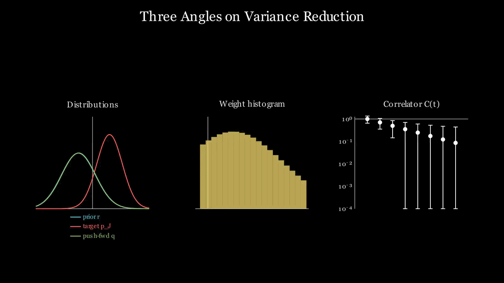
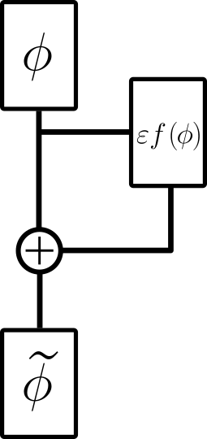
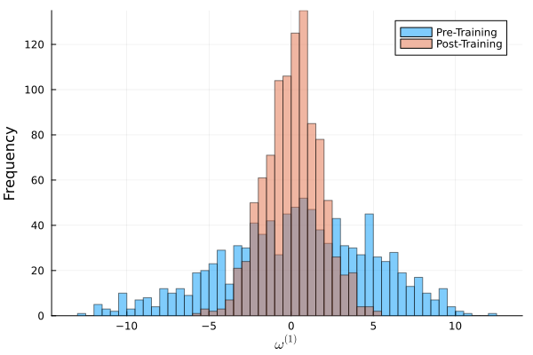

# SADflow.jl

**Learned variance reduction for Monte Carlo correlators in lattice field theory.**

SADflow trains a neural network to deform Monte Carlo configurations so that
the reweighting factors used to measure a correlation function become almost
constant. Constant weights mean an estimator with (nearly) zero variance, and
the estimator stays **unbiased for any network**: training can only change the
noise, never the expectation value.

The current implementation targets two-dimensional scalar $\phi^4$ theory and
accompanies

> L. Spatscheck, *A Variational Framework to Tackle Signal-to-Noise Degradation
> in Lattice Field Theory*, Master's thesis, University of Southern Denmark
> (2026), in collaboration with the University of Turin and INFN.
>
> P. Butti, G. Catumba, A. Nada, L. Spatscheck, *A variational framework for
> variance reduction in lattice field theory*, LATTICE 2026 proceedings.

<p align="center">
  
</p>

---

## The idea

**The signal-to-noise problem.** The zero-momentum two-point function
$C(t)=\langle\mathcal O_t\,\mathcal O_0\rangle$, with
$\mathcal O_t=\sum_{\vec x}\phi(t,\vec x)$, decays like $e^{-mt}$, but the
variance of its standard Monte Carlo estimator does not. The relative error
therefore grows exponentially with the separation $t$.

**Correlators as derivatives.** Coupling an infinitesimal source to the
operator at $t=0$, $S_\varepsilon = S - \varepsilon\,\mathcal O_0$, turns the
correlator into the derivative of a one-point function,

$$
C(t)=\partial_\varepsilon\langle\mathcal O_t\rangle_\varepsilon\Big|_{\varepsilon=0},
$$

which is measured on the ordinary (unsourced) ensemble by reweighting. The
noise of this estimator is set by the fluctuations of the order-$\varepsilon$
coefficient of the weights. The derivative in $\varepsilon$ is carried through
the Monte Carlo average with truncated power series
([FormalSeries.jl](https://igit.ific.uv.es/alramos/formalseries.jl)); this
*stochastic automatic differentiation* is the "SAD" in the name.

**Transport.** Each configuration is deformed by a learned map

$$
T_\varepsilon(\phi)=\phi+\varepsilon\,f_\theta(\phi),
$$

<p align="center">
  
</p>

where $f_\theta$ is a neural network acting on the periodic lattice. The
reweighting factors become

$$
\tilde\omega_\varepsilon(\phi)=\exp\Big(S[\phi]-S[T_\varepsilon\phi]+\varepsilon\,\mathcal O_0(T_\varepsilon\phi)+\varepsilon\,\mathrm{tr}\,J_{f_\theta}(\phi)\Big)=1+\varepsilon\,\rho(\phi)+\mathcal O(\varepsilon^2).
$$

If $\rho(\phi)=0$ on every configuration, the weights are constant and the
estimator has zero variance.

**Training.** To leading order in $\varepsilon$, the Kullback–Leibler
divergence between the transported ensemble and the source-deformed target is

$$
D_{\mathrm{KL}}(q_\varepsilon\|p_\varepsilon)=\frac{\varepsilon^2}{2}\Big(\mathbb E\big[\mathrm{tr}\,J_f^2+f^{\top}H_S f-2\,f\cdot\nabla\mathcal O_0\big]+\mathrm{Var}[\mathcal O_0]\Big)+\mathcal O(\varepsilon^3),
$$

with $H_S$ the Hessian of the action. Minimising it with Adam is equivalent to
minimising $\langle\rho^2\rangle$. The non-local term $\mathrm{tr}\,J_f^2$ is
estimated with Hutchinson probes.

The effect on the order-$\varepsilon$ weights, for the free theory on an
$8\times8$ lattice (from the example notebook):

<p align="center">
  
</p>

## Results

From the full study in the thesis ($32\times8$ lattice, training runs of
$\mathcal O(10^4)$ epochs, scans in $\kappa$ and $\lambda$):

| Theory | Variance of the correlator, trained / standard |
|---|---|
| Free ($\lambda=0$) | reduced by 6–8 orders of magnitude, largest gains closest to criticality ($\kappa\to 1/4$) |
| $\lambda=0.005$ | $\approx 10^{-2}$ |
| $\lambda=0.05$ | $\approx 3\times10^{-1}$ |
| $\lambda=0.5$ | just below break-even |

The main limitation is the stochastic estimate of the Jacobian trace, which
limits both the residual variance and the quality of the trained map.

## Installation

SADflow is developed with **Julia 1.12**. Clone the repository and instantiate
the environment:

```bash
git clone https://github.com/louis-spatscheck/SADflow.jl.git
cd SADflow.jl
julia --project=. -e 'using Pkg; Pkg.instantiate()'
```

`ADerrors`, `FormalSeries` and `BDIO` are not in the General registry. They are
pinned in `Manifest.toml` and fetched from their institutional GitLab
instances during `instantiate`, so those hosts must be reachable.

To check the installation:

```bash
julia --project=. -e 'using Pkg; Pkg.test()'
```

## Quick start

### Example notebook

[`examples/masters_thesis_transport_map.ipynb`](examples/masters_thesis_transport_map.ipynb)
is a self-contained walkthrough: data, transport network, training, and the
weight distributions before and after. It runs on the small free-theory
ensemble shipped in `priors/2d_l0.0_k0.24_L_8_8.jld2`. Open it in Jupyter or
VS Code with a Julia 1.12 kernel.

### Command-line training

```bash
julia --project=. scripts/train.jl -k 0.24 -l 0.0 -e 200 -b 64 -n 4 -a tanh
```

| Flag | Meaning | Default |
|---|---|---|
| `-k`, `--kappa` | hopping parameter $\kappa$ | required |
| `-l`, `--lambda` | quartic coupling $\lambda$ | required |
| `-e`, `--epochs` | training epochs | 100 |
| `-b`, `--batchsize` | training batch size | 64 |
| `--test_batchsize` | batch size for held-out loss | 512 |
| `-r`, `--lr` | Adam learning rate | 1e-3 |
| `--split` | training fraction of the ensemble | 0.75 |
| `-n`, `--nodes` | channels in the convolutional layers | 4 |
| `-a`, `--activation` | `tanh`, `relu`, `gelu`, `swish`, `softplus`, `sigmoid`, `identity` | `tanh` |
| `--priors-dir` | directory with the ensembles | `priors/` |
| `--output-dir` | directory for models and plots | `results/` |
| `--seed` | random seed | 1234 |

A GPU is used automatically when CUDA is functional. The run writes the model
(`results/models/<run>.bson`), its metadata and training curves
(`<run>_metadata.jld2`), and a diagnostic plot to `results/plots/`. To re-plot a
finished run:

```bash
julia --project=. scripts/plot_results.jl --metadata results/models/<run>_metadata.jld2
```

### Using the library

```julia
using SADflow, Flux

space  = Grid{2}((8, 8), (8, 8))
params = Phi4Params(0.24, 0.0)                     # κ, λ

pics  = load_prior_data("priors/2d_l0.0_k0.24_L_8_8.jld2")
var_z = estimate_source_variance(pics)
prior, prior_test, _, _ = split_data(pics, 0.75)

model = make_model(space, params; nodes=4, activation=tanh)
opt   = Flux.setup(Flux.Adam(1e-3), model)

for epoch in 1:100
    train_epoch!(model, opt, prior, 64, var_z, params; loss_function=KLloss_batch, K=10)
end

rw = evaluate_reweighting_checkpoint(model, prior_test, params; N=100)
rw.corr    # improved correlator C(t), with Γ-method errors (ADerrors)
```

### Ensembles

Ensembles are JLD2 files named `2d_l{λ}_k{κ}_L_{L1}_{L2}.jld2`, containing an
array `pics` of shape `(L1, L2, 1, N_cfg)` of HMC configurations. The small
$8\times8$ free-theory ensemble used by the examples is included; the larger
ensembles from the thesis are not part of the repository.

## Repository layout

```text
SADflow.jl/
├── src/
│   ├── SADflow.jl        # module definition and public API
│   ├── Lattice.jl        # Grid, boundary conditions, neighbour sums
│   ├── ActionPhi4.jl     # φ⁴ action, Hessian, source derivative
│   ├── AutoDiff.jl       # FFTs on dual numbers, ADerrors ↔ FormalSeries glue
│   ├── Models.jl         # periodic convolutions, transport network
│   ├── Losses.jl         # Hutchinson trace estimators, KL loss
│   ├── Observables.jl    # correlators, effective masses, reweighting
│   ├── Training.jl       # training and evaluation loop helpers
│   ├── data.jl           # loading and splitting ensembles
│   ├── io.jl             # saving runs and metadata
│   ├── plotting.jl       # training plots
│   └── Utils.jl          # batching and shuffling
├── scripts/              # train.jl, plot_results.jl
├── examples/             # walkthrough notebook
├── hpc/                  # thesis production scripts (see hpc/README.md)
├── test/                 # test suite (Pkg.test())
├── priors/               # Monte Carlo ensembles
├── images/               # figures used in this README
├── Project.toml
└── Manifest.toml
```

## Citation

If you use this code, please cite the thesis and the proceedings listed at the
top of this page.

## Related work

M. S. Albergo et al., *Introduction to Normalizing Flows for Lattice Field
Theory*, [arXiv:2101.08176](https://arxiv.org/abs/2101.08176).
